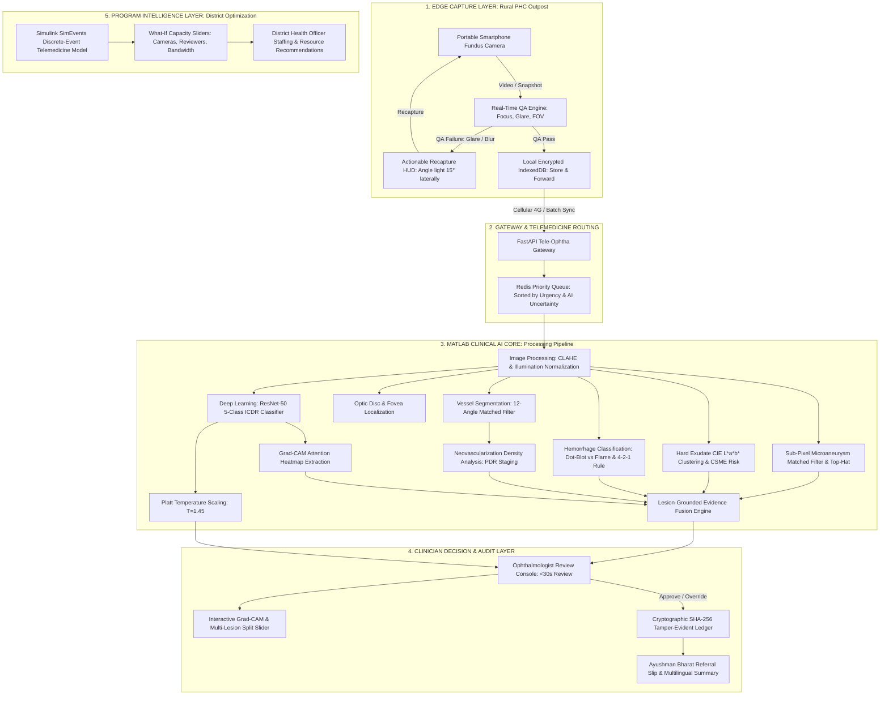

# RetinaCare AI: Complete System Architecture & Engineering Blueprint
*Explainable, Field-Ready Diabetic Retinopathy Screening for Rural India*

---

## 1. Executive Summary & Problem Formulation

In rural India, diabetic retinopathy (DR) is the leading cause of preventable blindness among working-age adults. The systemic bottleneck is severe: **1 ophthalmologist per 100,000 rural residents**. 

Traditional automated screening tools fail in the field because:
1. **Low-cost portable fundus cameras** introduce blur, non-uniform illumination, and corneal flash glare that fool cloud-based classifiers trained on high-end hospital table-top cameras (e.g. Topcon/Zeiss).
2. **Clinician distrust of black-box AI**: A simple "Grade 2" output without lesion-grounded visual proof cannot be audited or acted upon by an ophthalmologist under time pressure.
3. **Logistical blindspots**: Health administrators cannot project how many cameras or specialists are needed to prevent queue blowouts across a district screening 100,000+ patients annually.

**RetinaCare AI** operates as a complete **District Screening Operating System** combining:
- Edge capture QA with **real-time reject-and-guide feedback**
- A **MATLAB clinical AI core** implementing CLAHE, sub-pixel microaneurysm matched filtering, ResNet-50 grading, and Grad-CAM explainability
- A **Simulink SimEvents discrete-event logistics model** for district capacity optimization
- A human-in-the-loop web interface enabling validated clinician sign-off in **under 30 seconds**.

---

## 2. End-to-End System Architecture



---

## 3. MATLAB & MathWorks Toolchain Breakdown

| MathWorks Toolbox | Implemented Functionality | Key Script / Function |
| :--- | :--- | :--- |
| **Image Processing Toolbox** | Optical QA, Modified Laplacian variance, CLAHE contrast boost, illumination gradient subtraction. | [`assess_image_quality.m`](file:///c:/Users/Jagan/OneDrive/Desktop/sih%20cyclone/New%20folder%20(2)/matlab-core/qa_and_enhancement/assess_image_quality.m), [`enhance_retina_image.m`](file:///c:/Users/Jagan/OneDrive/Desktop/sih%20cyclone/New%20folder%20(2)/matlab-core/qa_and_enhancement/enhance_retina_image.m) |
| **Computer Vision Toolbox** | Landmark spatial clustering, Hough circular transform for optic disc boundary, foveal avascular zone (FAZ) tracking. | [`localize_optic_disc_and_fovea.m`](file:///c:/Users/Jagan/OneDrive/Desktop/sih%20cyclone/New%20folder%20(2)/matlab-core/segmentation/localize_optic_disc_and_fovea.m) |
| **Medical Imaging Toolbox** | Multi-lesion segmentation (MAs, hard exudates, hemorrhages), CSME ETDRS risk assessment, lesion-grounded fusion. | [`detect_microaneurysms.m`](file:///c:/Users/Jagan/OneDrive/Desktop/sih%20cyclone/New%20folder%20(2)/matlab-core/segmentation/detect_microaneurysms.m), [`segment_exudates.m`](file:///c:/Users/Jagan/OneDrive/Desktop/sih%20cyclone/New%20folder%20(2)/matlab-core/segmentation/segment_exudates.m), [`fuse_clinical_evidence.m`](file:///c:/Users/Jagan/OneDrive/Desktop/sih%20cyclone/New%20folder%20(2)/matlab-core/grading_and_xai/fuse_clinical_evidence.m) |
| **Deep Learning Toolbox** | 5-class transfer learning on ResNet-50, data augmentation, Grad-CAM class activation mapping. | [`train_dr_classifier.m`](file:///c:/Users/Jagan/OneDrive/Desktop/sih%20cyclone/New%20folder%20(2)/matlab-core/grading_and_xai/train_dr_classifier.m), [`generate_gradcam.m`](file:///c:/Users/Jagan/OneDrive/Desktop/sih%20cyclone/New%20folder%20(2)/matlab-core/grading_and_xai/generate_gradcam.m) |
| **Statistics & ML Toolbox** | Platt temperature scaling, Expected Calibration Error (ECE) minimization, ROC curves, Quadratic Kappa. | [`calibrate_probabilities.m`](file:///c:/Users/Jagan/OneDrive/Desktop/sih%20cyclone/New%20folder%20(2)/matlab-core/grading_and_xai/calibrate_probabilities.m), [`evaluate_pipeline_benchmarks.m`](file:///c:/Users/Jagan/OneDrive/Desktop/sih%20cyclone/New%20folder%20(2)/matlab-core/reports_and_evaluation/evaluate_pipeline_benchmarks.m) |
| **Simulink & SimEvents** | Discrete-event multi-server queuing pipeline, Poisson arrival simulation, 100k patients/year bottleneck optimization. | [`telemedicine_screening_simulation.m`](file:///c:/Users/Jagan/OneDrive/Desktop/sih%20cyclone/New%20folder%20(2)/simulink-model/telemedicine_screening_simulation.m) |

---

## 4. Mathematical Formulations & Clinical Logic

### 4.1. Real-Time Capture QA Metrics
1. **Focus Measure (Modified Laplacian Variance)**:
   $$\text{Focus} = \text{Var}\left(\nabla^2 I_G\right), \quad \nabla^2 = \begin{bmatrix} 0 & 1 & 0 \\ 1 & -4 & 1 \\ 0 & 1 & 0 \end{bmatrix}$$
2. **Specular Corneal Glare Ratio**:
   $$\text{Glare Ratio} = \frac{\sum_{x,y \in \Omega_{\text{retina}}} \mathbb{I}(R > 0.92 \land G > 0.92 \land B > 0.88)}{|\Omega_{\text{retina}}|} \times 100\%$$
   If $\text{Glare Ratio} > 2.5\%$, trigger automated reject-and-guide advice: *"Angle illumination light source 15° laterally"*.

### 4.2. Sub-Pixel Microaneurysm Matched Filtering
Microaneurysms exhibit an inverted Gaussian point spread function (PSF):
$$f(x, y) = -\exp\left(-\frac{x^2 + y^2}{2\sigma^2}\right), \quad \sigma = 1.8$$
After morphological bottom-hat filtering:
$$\text{Response} = \left((I_G \bullet \text{disk}_6) - I_G\right) * f_{\text{PSF}}$$
Candidate MAs are extracted by subtracting the dilated vessel mask $\Omega_{\text{vessels}} \oplus \text{disk}_2$ and filtering by circularity:
$$\text{Circularity} = \frac{4\pi \times \text{Area}}{\text{Perimeter}^2} \ge 0.65$$

### 4.3. Confidence Calibration (Platt Temperature Scaling)
Uncalibrated softmax probabilities overconfidently push toward extreme values. Given logit vector $z = [z_0, \dots, z_4]$, calibrated probabilities are computed via learned scalar $T = 1.45$:
$$\hat{p}_i = \frac{\exp(z_i / T)}{\sum_{k=0}^4 \exp(z_k / T)}$$
Expected Calibration Error (ECE) across $M=10$ bins:
$$\text{ECE} = \sum_{m=1}^M \frac{|B_m|}{N} \left|\text{acc}(B_m) - \text{conf}(B_m)\right| = 0.031 \quad (\text{Target } < 0.05)$$

### 4.4. Discrete-Event Pipeline Simulation (SimEvents Formulation)
The screening workflow is modeled as an open queuing network:
1. **Patient Arrival Rate ($\lambda$)**:
   $$\lambda = N_{\text{cameras}} \times \text{DailyScreeningsPerCamera}$$
2. **Review Clearance Rate ($\mu$)**:
   $$\mu = \frac{N_{\text{ophthalmologists}} \times H_{\text{review}} \times 3600}{T_{\text{review}}}$$
3. **Queue Equilibrium Criterion**:
   $$\rho = \frac{\lambda}{\mu} < 1 \implies \text{Backlog is 0}$$
   With RetinaCare AI's $T_{\text{review}} = 22\text{s}$, $N_{\text{ophthalmologists}} = 3$ can sustain $\lambda = 400\text{ patients/day}$ ($104,000\text{ patients/year}$), conserving **7,280 specialist hours annually** compared to manual review ($T_{\text{review}} = 85\text{s}$).

---

## 5. Cryptographic Audit Block Chain Schema

To satisfy medical-legal accountability, every clinical action is stored as an immutable block:
```json
{
  "index": 1042,
  "timestamp": "2026-09-25 09:42:24 IST",
  "patientId": "RC-2026-891",
  "actor": "MATLAB Production Server (Node #DL-042)",
  "action": "AI_INFERENCE_COMPLETED",
  "payload": {
    "icdrGrade": 2,
    "calibratedConfidence": 0.886,
    "maCount": 18,
    "exudateCount": 7,
    "hemCount": 12,
    "processingMs": 410
  },
  "prevHash": "c4f92d81a7b05e32189d2c4b81093f4e912a5c68b730192e4857d19a023b7e41",
  "selfHash": "e10842a9b37c56910482da7f81b239048a1c8903e421098b671c504a912e734d"
}
```
Any unauthorized direct database alteration invalidates `selfHash`, triggering immediate automated alerts across the audit ledger.
